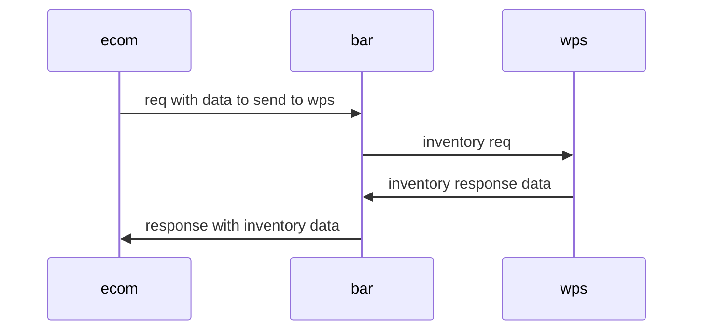



this

that 

another thing


## testing footnotes

This is a footnote yo[^1]

[^1]: and this is the corrosponding footnote

# H1

## H2

### H3

#### H4



## Paragraphs are cool!

font Sed ut perspiciatis unde omnis iste natus error sit voluptatem accusantium doloremque laudantium, totam rem aperiam, eaque ipsa quae ab illo inventore veritatis et quasi architecto beatae vitae dicta sunt explicabo. Nemo enim ipsam voluptatem quia voluptas sit aspernatur aut odit aut fugit, sed quia consequuntur magni dolores eos qui ratione voluptatem sequi nesciunt. Neque porro quisquam est, qui dolorem ipsum quia dolor sit amet, consectetur, adipisci velit, sed quia non numquam eius modi tempora incidunt ut labore et dolore magnam aliquam quaerat voluptatem. Ut enim ad minima veniam, quis nostrum exercitationem ullam corporis suscipit laboriosam, nisi ut aliquid ex ea commodi consequatur? Quis autem vel eum iure reprehenderit qui in ea voluptate vlit esse quam nihil molestiae consequatur, vel illum qui dolorem eum fugiat quo voluptas nulla pariatur?



## audio player

<audio src='2019-12-16T13-49-53-record.wav' controls><a href='2019-12-16T13-49-53-record.wav'>audio rec</a></audio>

## Standard Youtube shortcode



## Custom vimeo shortcode



## An Iframe shortcode



## asciinema shortcode

You can record screen captures of your terminal and share them.  Oh...and you can copy and paste from the screencapture.  It is a great way to share commands with full context.





The modal is for when you would like to give some extra context but dont want to
distract from the main thread.

In physics and classical mechanics, the three-body problem is the problem of
taking the initial positions and velocities (or momenta) of three point masses
and solving for their subsequent motion according to Newton's laws of motion and
Newton's law of universal gravitation.[1] The three-body problem is a special
case of the n-body problem. Unlike two-body problems, no general closed-form
solution exists,[1] as the resulting dynamical system is chaotic for most
initial conditions, and numerical methods are generally required.



## mermaid charts

I added a custom mermaid codeblock 



## svg shortcode

Put an svg in the static folder and link it with this shortcode
It will embed the svg in the page with the added ability to pan and zoom.

```
    
```





## an image from the local site


## A local video in my static folder



## blog-image

Image URLs are based on `Site.Params.imagehost ` found in the `config.yml` file at the root of the site

```


```




